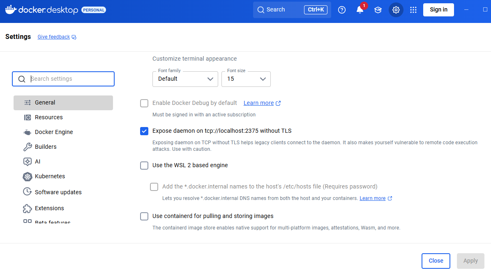

# Macro ERP (Docker)

## Requerimentos
- Docker

## Detalhes
Projeto usando `docker-compose`, levantando uma imagem do server PHP e outra do banco MySql.

## Instalação

Copie o `.env.example` para `.env`.
Se for usar localmente isso é suficiente e o build fará o ajuste do resto. Se for para outros ambientes, ajustar conforme necessidade.

Buildando pela primeira vez, instalando requerimentos do `composer` , construindo e populando o banco localmente (salvo na pasta `mysql-data`).:

`docker-build.bat`

Para as vezes seguintes, somente levantando os servers:

`docker-up.bat`

Acessando o servidor de php via terminal:

`docker-terminal-app.bat`

Aplicação disponível em http://localhost

## Alternativas para docker-compose
Caso o docker-compose tenha problemas, existem as versões equivalentes de
`docker-build.bat` e `docker-up.bat` que usam os comandos de docker puro para executar o mesmo ambiente descrito em `docker-compose.yaml` e são respectivamente:

`docker-build-v2.bat` `docker-up-v2.bat`

## Problemas de performance com Docker
Projetos grandes dentro do docker parecem ficar mais lentos do que deveriam, ao menos em ambiente windows.
Uma das soluções é ir nas configuração do docker e desmarcar a opção `Use the WSL 2 based engine`.

